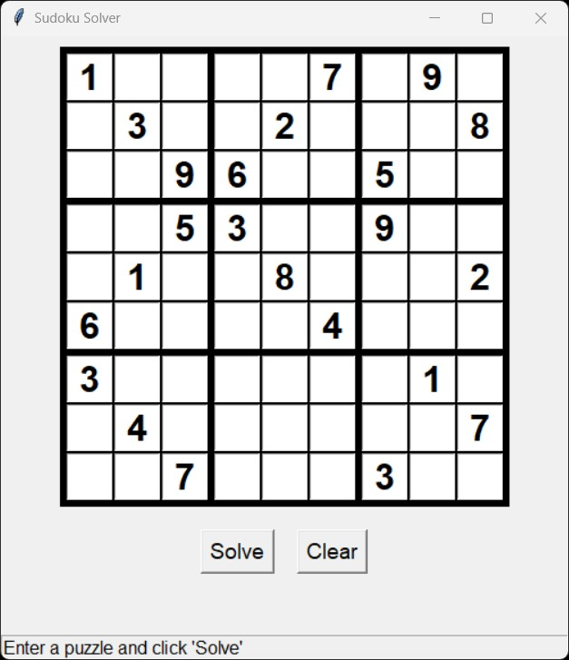
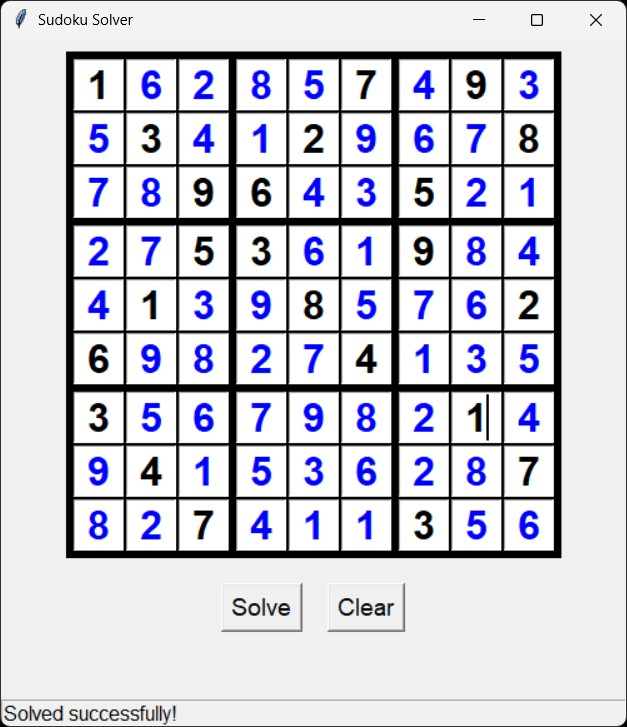

# Python Sudoku Solver with GUI 🧩

A simple yet powerful Sudoku solver written in Python, featuring a user-friendly graphical interface built with Tkinter. The solver uses a hybrid approach, combining logical deduction with recursive backtracking to handle even the most difficult puzzles efficiently.

---

## Screenshots

The interface is clean and straightforward. You enter the numbers you know, click "Solve," and the program does the rest. The solved numbers appear in blue.

<table>
  <tr>
    <td align="center"><strong>Before</strong></td>
    <td align="center"><strong>After</strong></td>
  </tr>
  <tr>
    <td></td>
    <td></td>
  </tr>
</table>

---

## ✨ Features

- **Graphical User Interface:** Easily input puzzles using a clean grid built with Tkinter.
- **Hybrid Solving Algorithm:** First, it uses logical deduction to find "forced" moves. If the puzzle isn't solved, it uses a recursive backtracking algorithm.
- **Instant Results:** Solves most standard 9x9 puzzles in a fraction of a second.
- **Visual Feedback:** Solved numbers are highlighted in blue to distinguish them from the initial clues.
- **Solution Validator:** Includes a function to verify that the final solution adheres to all Sudoku rules.

---

## 🛠️ Requirements

- Python 3.x
- NumPy
- Tkinter (this is included in most standard Python installations)

---

## 🚀 Getting Started

Follow these steps to get the solver running on your local machine.

1.  **Clone the repository:**
    ```bash
    git clone https://github.com/mortorit/SudokuSolver.git
    cd SudokuSolver
    ```

2.  **Install the required package (NumPy):**
    ```bash
    pip install numpy
    ```

---

## 🎮 How to Use

1.  **Run the script from your terminal:**
    ```bash
    python graphical_sudoku.py
    ```

2.  **Enter the puzzle:** Type the known numbers into the grid cells.

3.  **Click "Solve":** The algorithm will run and fill in the solution on the grid.

4.  **Click "Clear":** To reset the grid and solve a new puzzle.
